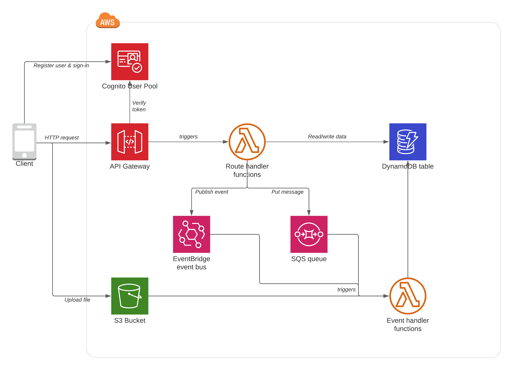

# Sports Club Manager application
A **Sports Club Manager** app will be used for exercises throughout the workshop.

## Architecture
The diagram below gives a high-level overview of the AWS services used to build the app.

*Note that we are only focused on the back-end architecture during this workshop, so when you see the word "Client" below you can assume it means a web or mobile app.*

### User management
A single [Cognito User Pool](https://docs.aws.amazon.com/cognito/latest/developerguide/cognito-user-identity-pools.html) is used to store user credentials. Clients use the Cognito API directly to register new users and to sign in using email address and password. The JWT token returned from Cognito is then supplied as a HTTP header in requests to the REST API.

### REST API
A single [API Gateway](https://docs.aws.amazon.com/apigateway/latest/developerguide/welcome.html) REST API is where clients will send their requests to. All API routes that require authentication will be configured to use the Cognito user pool.

### Route handler Lambda functions
Each API Gateway route has its own dedicated Lambda function attached to it. API Gateway will synchronously hand-off requests to the handler and await their completion before sending a response to the client. Individual handler functions may talk to different downstream services (e.g. DynamoDB, EventBridge, SQS) as needed.

### Asynchronous background tasks
Several use cases don't require waiting on the user, so can implemented using asynchronous flows.
These asynchronous flows are initiated by messages being published to the [EventBridge](https://docs.aws.amazon.com/eventbridge/latest/userguide/what-is-amazon-eventbridge.html) event bus or to an [SQS queue](https://docs.aws.amazon.com/AWSSimpleQueueService/latest/SQSDeveloperGuide/welcome.html).

### Event handler Lambda functions
Event handler Lambda functions are subscribed to certain message types in EventBridge or SQS. They then perform further processing, talking to whatever downstream AWS services they need to.

### Application database
[DynamoDB](https://docs.aws.amazon.com/amazondynamodb/latest/developerguide/Introduction.html) is used to persist structured application data.

### File storage
An S3 bucket is used to allow clients to upload files. Lambda handlers can be subscribed to S3 events in order to perform further processing (e.g. updating DynamoDB) once an upload completes.

## Application use cases
The following table describes the core use cases of the app, along with their associated REST API endpoint and the AWS services which that use case touches.

| User role 	| Scenario 	| API route 	| Services used 	|
|------	|----------	|--------------	|---------------	|
| AnonPublic | List all Clubs marked as public | `GET /clubs` | APIGW, Lambda, DynamoDB |
| Manager | Create new Club and set as public/private.   (Private clubs are only visible to managers or players of that club) | `POST /clubs` | APIGW, Cognito, Lambda, DynamoDB |
| Manager, Player | List all Clubs that I am a member of (either as a Manager or Player) | `GET /me/clubs` | APIGW, Cognito, Lambda, DynamoDB |
| Manager | Upload ProfilePicture for the Club | `PUT /clubs/{id}/profile-pic` | APIGW, Cognito, Lambda, DynamoDB, S3 |
| Manager | Invite Players to join the Club via email | `POST /clubs/{id}/players` | APIGW, Cognito, Lambda, DynamoDB, EventBridge, SNS |
| Player     	| Join a public Club without an invite | `POST /clubs/{id}/join` | APIGW, Cognito, Lambda, DynamoDB, EventBridge |
| Player     	| Join a private Club with an invite | `POST /clubs/{id}/join`  (`invitationToken` in body) | APIGW, Cognito, Lambda, DynamoDB, EventBridge |
| Manager     	| Receive email notification whenever Players join a Club that I own         | n/a | EventBridge, Lambda, SNS |
| Manager     	| Create a new ScheduledGame | `POST /clubs/{id}/games` | APIGW, Cognito, Lambda, DynamoDB, EventBridge |
| Player     	| Receive email notifications whenever new ScheduledGame is created for a Club I play for | n/a | EventBridge, Lambda, SNS |

