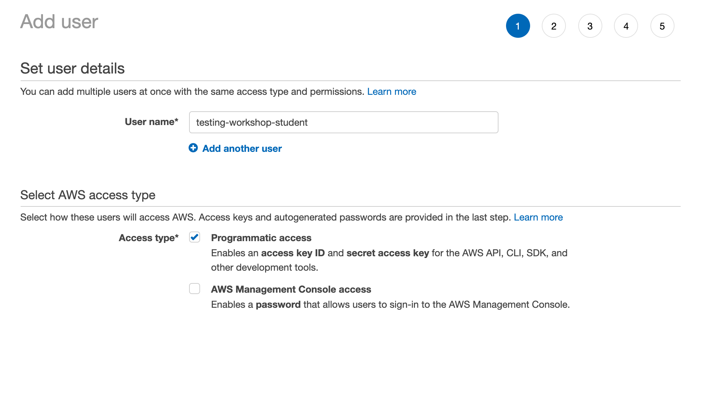
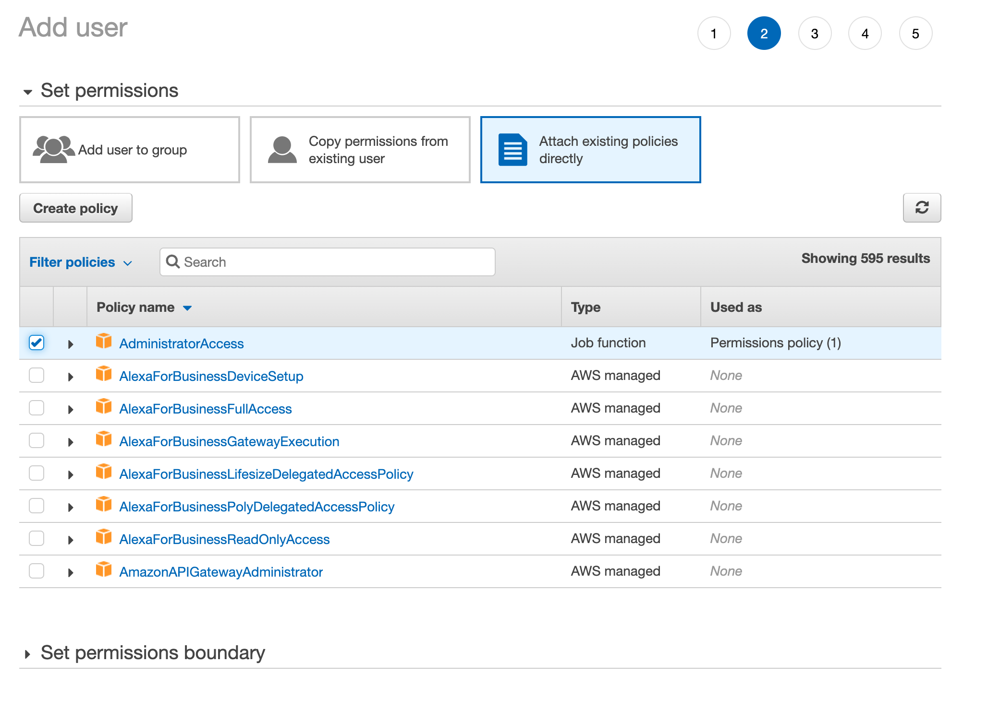
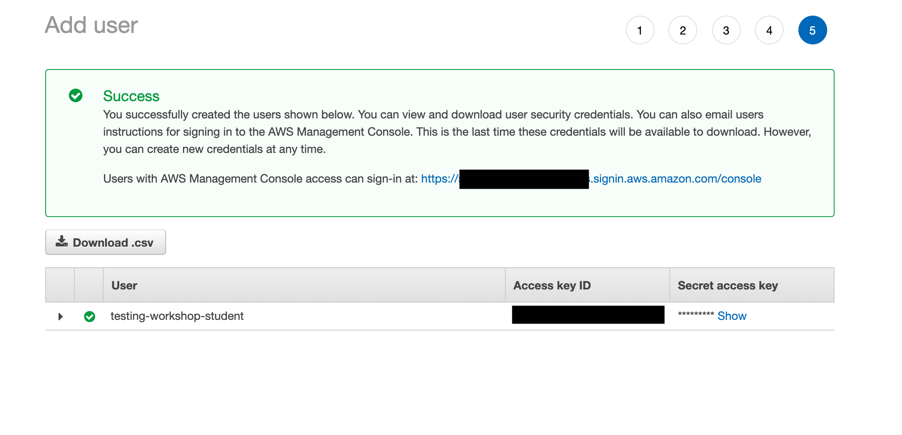

# Development environment setup
## Pre-requisites
- You have full console access to an AWS account for which you have "Administrator Access" permissions.
- The following software is installed on your developer workstation:
    - [Node.js v12.x](https://nodejs.dev/learn/how-to-install-nodejs)
    - [AWS CLI](https://docs.aws.amazon.com/cli/latest/userguide/cli-chap-install.html)
    - (optional) [VS Code](https://code.visualstudio.com)—this is used in the video lessons and some lessons (e.g. debugging) use VSCode-specific features

## AWS Account setup

### Create IAM user using AWS Console
In order to deploy AWS resources and run our integration and E2E tests, we need to create a single IAM user `testing-workshop-student`. To do this, follow these steps:

1. Open the [AWS IAM Console](https://console.aws.amazon.com/iam/home#/users), click on the "Users" tab and then
2. In the "User name" field, enter `testing-workshop-student`, check the Programmatic Access checkbox and click "Next:Permissions" button. There is no need to enable AWS Management Console access if you are already logged in to the console with a user with admin privileges. 
3. In the "Set permissions" dialog, click the "Attach existing policies directly" tab and select the "AdministratorAccess" policy. Then click "Next:Tags" button and then the "Next:Review" button (no need to add tags) 
4. Click the "Create user" button
5. On the final screen, be sure to copy the values for the Access key ID and Secret access key as we will use them in the next section 

### Create CLI profile
1. In a terminal window, run:
```sh
aws configure --profile testing-workshop-student
```
2. When prompted for the AWS Access Key ID and Secret access key, enter the values that you copied in the previous section.
3. When prompted for default region enter `eu-west-1` (this is the Ireland region where the sample exercised are preconfigured for)
4. Hit enter to finalise profile creation
